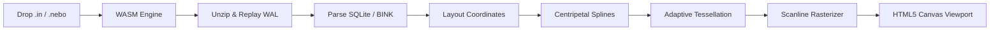

# Notein & Nebo Note Viewer

Browser-based, privacy-first viewer and vector exporter for **Notein** (`.in`) and **Nebo** (`.nebo`) handwriting notes. Drop a file in to pan, zoom, inspect media, and export vector ink — everything executes locally in your browser via WebAssembly.

---

## Features

- **Drag & Drop Local Parsing**: Instant loading of `.in` (ZIP + SQLite) and `.nebo` (ZIP + BINK/BDOM) files without any server upload or backend processing.
- **Infinite Canvas & Bounded Pages**: Smooth panning, continuous zoom from overview to macro scale, and interactive minimap navigation.
- **High-Fidelity Vector Ink**:
  - Centripetal Catmull-Rom spline interpolation with exact analytical polynomial derivatives.
  - Dynamic zoom-adaptive tessellation ($\le 0.6$ pixels per step).
  - Curvature-bounded inner offsets preventing retrograde loops and winding cancellation holes.
  - Broad-nib / calligraphy angle modulation and pressure dynamics.
- **Export Options**:
  - Export custom selection regions or full pages.
  - High-resolution **PNG** (1×, 2×, 4×, 8×), **PDF**, and scalable **SVG**.
- **Embedded Media & Links**:
  - Image gallery with thumbnails and direct downloads.
  - In-browser audio player for embedded voice recordings.
  - Interactive hyperlink navigation.
  - One-click ZIP download of all embedded note media.
- **Dark Mode Support**: Involutional HSL lightness inversion preserving pen hues and saturations.

---

## Technical Documentation

Detailed architectural and reverse-engineering specifications are located in [`docs/`](docs/):

- [**`docs/STROKE_RENDER.md`**](docs/STROKE_RENDER.md) — Comprehensive technical report on spline smoothing, analytical derivatives, zoom-adaptive tessellation, curvature bounding, and SIMD scanline rasterization.
- [**`docs/NOTEIN_FORMAT.md`**](docs/NOTEIN_FORMAT.md) — Specification for Notein `.in` ZIP containers, SQLite Room schema, WAL replay, coordinate systems, and stroke JSON payloads.
- [**`docs/NEBO_FORMAT.md`**](docs/NEBO_FORMAT.md) — Specification for Nebo `.nebo` ZIP packages, `ink.bink` binary delta streams, coordinate scaling, and `page.bdom` object graphs.

---

## Getting Started

### Local Development

**Prerequisites**: [Bun](https://bun.sh) 1.3+ and [Zig](https://ziglang.org) 0.17+.

```bash
# Clone the repository
git clone https://github.com/davidnoronha1/notein-export.git
cd notein-export/web

# Install dependencies
bun install

# Start Vite development server with automatic WASM rebuilding
bun run dev
```

### Production Build

```bash
cd web
bun run build       # Compiles optimized WASM + bundles Vite web assets into web/dist
bun run preview     # Preview production build locally
```

### Running Tests

```bash
cd wasm
zig test src/root.zig   # Runs all 34 native unit and integration tests
```

---

## Architecture



---

## Privacy

- **100% Client-Side**: Notes never leave your device. Parsing and rendering are performed entirely inside browser WebAssembly memory.
- **Read-Only**: The viewer inspects note archives without modifying your source files.

---

## License

MIT — see [LICENSE](LICENSE).
