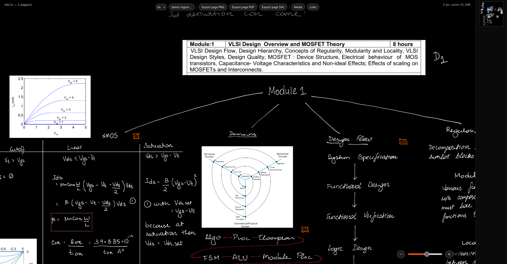

# notein-export

Browser-based viewer and exporter for **Notein** (`.in`) handwriting notes. Drop a `.in` file in and view, pan, and export — everything runs locally in your browser.

Unpacks the `.in` format (ZIP + SQLite) with a small Zig/WASM core, renders pressure-aware vector ink on `<canvas>`, and exports any region or page to **PNG / PDF / SVG** at 1× / 2× / 4×.



## Features

- **Drag & drop** `.in` file → instant local render, no upload
- **Infinite canvas + bounded pages** (A4 / Letter) — pan, zoom, and minimap with viewport indicator
- **Pressure-aware strokes** replayed as variable-width polygons, not bitmaps
- **Images, typed text, and shapes** composited in chronological order
- **Export** — select a region or export the whole page to PNG, PDF (`pdf-lib`), or true vector SVG. Selection menu follows your selection with a progress indicator for large exports
- **Media panel** — browse all embedded images and audio, jump to an image's location, play/download audio, or download everything as a single ZIP (ZIP assembly is done in Zig with real local/central headers and CRC32, no JS zip library)
- **Links panel** — browse all hyperlinks, jump to their position, or open externally

## File format

`.in` is a ZIP archive:

| File | Purpose |
|---|---|
| `note_database_note_<uuid>_db` | SQLite DB — all note content |
| `…_db-wal`, `…_db-shm` | WAL/journal (applied on load) |
| `note_meta.json` | Title, timestamps, folder, flags |
| `note_extra.json`, `note_in_flag.json`, `note_label.json`, `notepdf_lost_info.json` | Metadata / flags / labels |
| `note_image_<uuid>.*`, `note_audio_<uuid>.*` | Embedded images/audio, referenced by name from the DB |

Key tables: `NoteContentEntity`, `PageEntity`, `StrokeEntity` (`record_json` → `points: {x,y,p,action}[]`), `TextBoxEntity`, `ImageEntity`, `ShapeEntity`, `HyperLinkEntity`, `AudioFileEntity`, plus layers and outlines.

See [`FORMAT.md`](FORMAT.md) for the full reverse-engineering notes. To read programmatically: unzip → replay WAL → open `…_db` with any SQLite library → read `StrokeEntity.record_json` → replay points.

## Getting started

### Use the viewer

1. Open the viewer and drop a `.in` file onto the drop zone (or use the file picker)
2. Pan, zoom, and use the minimap to navigate
3. Drag to select a region or export the current page; use **Media** and **Links** to browse embedded assets

Files never leave your machine — parsing happens in WASM memory in the browser.

<details>
<summary><strong>Run locally</strong></summary>

**Prerequisites:** [Bun](https://bun.sh) 1.3+ and [Zig](https://ziglang.org) 0.17+ (nightly — uses `std.array_list.Managed`, `std.Io.Dir`, etc.).

```bash
git clone https://github.com/davidnoronha1/notein-export.git
cd notein-export

cd web
bun install
bun run build        # builds WASM (zig build) + web (vite) -> web/dist

bun run dev          # dev server with auto WASM rebuild -> http://localhost:5173
bun run preview      # preview a production build
```

</details>

### Tests

The Zig core has unit and integration tests. Integration tests need a local `.in` fixture (git-ignored) and skip gracefully if none is present:

```bash
cd wasm
zig build test                              # unit tests
zig build test -- --test-filter diary       # integration (requires fixtures/*.in)

# to enable integration tests locally:
# drop any .in export as fixtures/diary.in and rerun
```

`fixtures/*.in` and `*.in` are git-ignored — don't commit note samples.

## Project structure

```
notein-export/
├── FORMAT.md              # reverse-engineered .in spec
├── assets/screenshot.png  # viewer screenshot
├── wasm/                  # Zig → WASM core (zip, SQLite btree/pager, raster)
│   ├── src/main.zig       # WASM C-ABI (alloc/open/render/get_visible_*/build_media_zip)
│   ├── src/model.zig      # note model (pages/strokes/images/text/links/audio, content_bounds)
│   ├── src/tessellate.zig # pressure → polygon ribbon, quad for shape edges
│   ├── src/window.zig     # lazy JSON decode + smoothing + spatial grid (active window)
│   ├── src/raster.zig     # scanline polygon fill (nonzero winding, AA)
│   ├── src/zip.zig        # ZIP reader for the .in container
│   ├── src/zip_writer.zig # ZIP writer (STORE) for media download-all
│   └── build.zig          # -> web/src/wasm/notein.wasm
├── web/                   # Vite + TypeScript + Preact viewer
│   ├── index.html
│   ├── src/main.ts        # app glue (file input, viewport, export wiring)
│   ├── src/wasm/loader.ts # typed WASM wrapper (zero-copy views)
│   ├── src/canvas/        # renderer, viewport, minimap, export-render, layout
│   ├── src/media-panel.tsx, src/links-panel.tsx, src/icons.tsx
│   └── src/export.ts      # PNG / PDF / SVG helpers
└── fixtures/              # local .in samples only (git-ignored)
```

## How it works

### End-to-end flow

```
.in file → ZIP → WAL replay → SQLite btree → model index (bounds + row refs)
        → active window (lazy JSON decode) → tessellation → raster / vector
        → chronological compositing → canvas + export
```

### 1. Loading

`wasm.open(ptr, len)` (`wasm/src/main.zig:main.zig:114`) unzips the `.in`, replays the SQLite WAL (`wasm/src/wal.zig`) onto the DB bytes, scans the btree (`wasm/src/sqlite/btree.zig`) and builds a cheap in-memory index in `model.zig:open` — per-item bounds + page association + a pointer back to the row. No `record_json` is parsed yet.

### 2. Coordinate spaces

Three spaces, and most bugs are mixing them up:

- **Page-local** — what WASM speaks. Stroke/image/text bounds and `render_viewport(page_index, x, y, w, h, ...)` are all relative to a page's own origin. Infinite-canvas content may be negative or far outside `[0, width]×[0, height]`.
- **World / note space** — one shared space per note, built once by `layoutNote()` (`web/src/canvas/layout.ts:46`). Bounded pages stack vertically with a gap and are centered horizontally (mixed orientations). Unbounded pages are sized to their real `content_bounds` (union of all item bounds, computed in `model.zig:expandContentBounds`) with padding, not the nominal `paper_spec` placeholder (`1920×1920`). `PageLayout.x/y` and `boxLeft/boxTop` map page-local → world.
- **Screen / device pixels** — `Viewport.camera` (`web/src/canvas/viewport.ts:21`) is `{x, y, zoom}` in CSS-pixel world units; `Renderer` converts to device pixels via `camera.zoom * viewport.dpr` for HiDPI.

`Renderer.renderPage()` (`web/src/canvas/renderer.ts:144`) intersects the page's world-space box with the camera viewport, converts back to page-local (`localX = vx0 - page.x`), and only then calls WASM — so WASM never sees world coordinates. `frameToBounds()` (`web/src/canvas/layout.ts:103`) does the inverse for "jump to image/link".

### 3. Active window & lazy decoding

A note can be tens of MB of stroke JSON. `model.zig` deliberately keeps `record_json` undecoded; `window.zig:Window.setActive` (`wasm/src/window.zig:352`) decodes only the pages in the current viewport (+1 page prefetch margin, recomputed every frame by `Renderer.updateActiveWindow` in `web/src/canvas/renderer.ts:128`). Leaving a page evicts its decoded strokes/shapes/text and frees the polygons. Re-entering re-decodes from the btree index.

Decoding a page also:
- **Smooths** raw points with Catmull-Rom subdivision (`window.zig:smoothPoints`, ~1 unit per step, capped at 12k points) so sparse samples don't facet at high zoom.
- **Tessellates** each stroke once into a filled ribbon polygon (`tessellate.zig:tessellateStroke` — pressure → radius, offset along the path normal) and caches it as `DecodedStroke.tess_poly`. The per-frame rasterizer reuses this unless a minimum-width floor demands a wider ribbon.
- **Builds a uniform spatial grid** (`window.zig:buildGrid` — CSR layout, ~√N cells) over `order` so viewport culling touches only nearby items instead of scanning every stroke on the page. A monotonic generation counter + `seen` stamps deduplicates items spanning multiple cells without clearing arrays each query (`main.zig:collectVisibleOrder`).

The minimap temporarily steals the active window to rasterize thumbnails, then calls `onActiveWindowStolen` so the renderer resyncs (`resyncActiveWindow`) before its next frame.

### 4. Tessellation & rasterization

- **Strokes:** `tessellateStroke` builds a `2×N` vertex closed polygon (left/right offset points per sample) using the normal of the local tangent. Shapes are stroke-only outlines: each edge becomes a quad via `quadForLine`.
- **Raster:** `raster.zig:Canvas.fillPolygon` is a scanline filler with nonzero winding (required — variable-width ribbons self-overlap at corners, and even-odd would leave holes) plus 4× vertical supersampling and fractional horizontal coverage for AA. A fast aliased fallback handles unusually wide spans that exceed the fixed coverage buffer. `raster.zig:renderPageContent` draws `order` in chronological order, calling `drawStroke` / `drawShape`; strokes reuse `tess_poly` when the width floor doesn't exceed the cached width.

### 5. Compositing in chronological order

Ink (strokes+shapes), images, and text boxes are merged by `creationTime` and drawn interleaved — not "all ink then all images". `render_viewport(..., time_min, time_max)` rasterizes only ink whose `creationTime` falls in that half-open interval, so `Renderer.renderPage` can do:

```
ink(-∞, t0), image@t0, ink(t0, t1), text@t1, ink(t1, ∞)
```

Export (`web/src/canvas/export-render.ts:53`) reuses the same path on an offscreen canvas at the chosen scale (1×/2×/4×, clamped by `MAX_EXPORT_DIMENSION`/`MAX_EXPORT_PIXELS`), but awaits image decoding so the file is complete before download. SVG export (`renderRegionToSvg`) calls `get_vector_content` instead — the same tessellated polygons emitted as `<path>` fills, keeping it resolution-independent.

### 6. Viewport & interaction

`Viewport` (`web/src/canvas/viewport.ts:20`) owns `camera`, handles pointer drag, pinch, and wheel (with `WHEEL_SETTLE_MS` debouncing), and exposes `isInteracting`. While interacting, `Renderer` rasterizes at `0.5×` linear resolution (`INTERACTION_LOD_SCALE`) and stretches up — pixel work dominates frame time (~29 ms vs. ~0.5 ms cull on a 3k-stroke note), so a softer mid-gesture frame beats dropped frames. On settle, the next frame re-renders at full quality. `frame()` centers a world-space rect by fitting it to the viewport with clamped zoom (`MIN_ZOOM`/`MAX_ZOOM`).

### 7. Minimap

Two modes (`web/src/canvas/minimap.ts:31`):

- **Paginated** (all pages bounded) — vertical strip of per-page thumbnails (96 px wide), stacked like the main layout; indicator tracks `camera.y`; auto-scrolls to keep the indicator visible.
- **Freeform** (any page unbounded) — single 2D thumbnail of the whole content bounds (`freeScale = 96 / worldWidth`); indicator is a free-moving rect on both axes, like a game minimap. Both modes use `render_viewport` with a `THUMB_MIN_STROKE_PX` floor so ink remains legible at tiny scale, and pre-downscale images via `createImageBitmap({resizeWidth, resizeHeight})`.

### 8. Media / Links panels

`get_all_images` / `get_all_links` / `get_all_audio` are called once, lazily, on first panel open — not at load time (`web/src/media-panel.tsx`, `web/src/links-panel.tsx`). Per-item bytes come from `get_bytes(name)` resolved from the ZIP by name. "Download all media" calls `build_media_zip()` (`wasm/src/main.zig:546`) which reads every `note_image_*` / `note_audio_*` asset from the already-open archive and assembles a real ZIP (STORE, local + central headers, CRC32) inside Zig (`wasm/src/zip_writer.zig`) — JS just downloads the bytes.

## Privacy

- `.in` files never leave your device. No backend, no upload, no telemetry.
- The viewer is read-only — it does not modify `.in` files.

## License

MIT — see [LICENSE](LICENSE).

