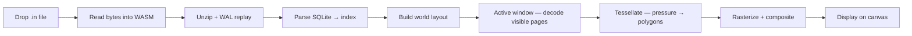

# notein-export


Browser-based viewer and exporter for **Notein** (`.in`) handwriting notes. Drop a `.in` file in and view, pan, and export — everything runs locally in your browser.

Unpacks the `.in` format (ZIP + SQLite) with a small Zig/WASM core, renders pressure-aware vector ink on `<canvas>`, and exports any region or page to **PNG / PDF / SVG**.

## Features

- **Drag & drop** `.in` file → instant local render, no upload
- **Infinite canvas + bounded pages** — pan, zoom, and minimap
- **Pressure-aware strokes** as vector polygons, composited with images, text, and shapes in chronological order
- **Export** — select a region or export the whole page to PNG, PDF, or SVG
- **Media & Links** — browse images, audio, and hyperlinks, jump to their location, preview or download individually, or grab all media as a single ZIP

## File format

See [`FORMAT.md`](FORMAT.md) for the full reverse-engineered `.in` spec.

## Getting started

### Use the viewer

1. Open the viewer and drop a `.in` file onto the drop zone (or use the file picker)
2. Pan, zoom, and use the minimap to navigate
3. Drag to select a region or export the current page; use **Media** and **Links** to browse embedded assets

Files never leave your machine — parsing happens in WASM memory in the browser.

<details>
<summary><strong>Run locally</strong></summary>

**Prerequisites:** [Bun](https://bun.sh) 1.3+ and [Zig](https://ziglang.org) 0.17+ (nightly — uses `std.array_list.Managed`, `std.Io.Dir`, etc.).

```bash
git clone https://github.com/davidnoronha1/notein-export.git
cd notein-export

cd web
bun install
bun run build        # builds WASM (zig build) + web (vite) -> web/dist

bun run dev          # dev server with auto WASM rebuild -> http://localhost:5173
bun run preview      # preview a production build
```

</details>

### Tests

The Zig core has unit and integration tests. Integration tests need a local `.in` fixture (git-ignored) and skip gracefully if none is present:

```bash
cd wasm
zig build test                              # unit tests
zig build test -- --test-filter diary       # integration (requires fixtures/*.in)

# to enable integration tests locally:
# drop any .in export as fixtures/diary.in and rerun
```

`fixtures/*.in` and `*.in` are git-ignored — don't commit note samples.

## Project structure

```
notein-export/
├── FORMAT.md              # reverse-engineered .in spec
├── assets/screenshot.png  # viewer screenshot
├── wasm/                  # Zig → WASM core (zip, SQLite btree/pager, raster)
│   ├── src/main.zig       # WASM C-ABI (alloc/open/render/get_visible_*/build_media_zip)
│   ├── src/model.zig      # note model (pages/strokes/images/text/links/audio, content_bounds)
│   ├── src/tessellate.zig # pressure → polygon ribbon, quad for shape edges
│   ├── src/window.zig     # lazy JSON decode + smoothing + spatial grid (active window)
│   ├── src/raster.zig     # scanline polygon fill (nonzero winding, AA)
│   ├── src/zip.zig        # ZIP reader for the .in container
│   ├── src/zip_writer.zig # ZIP writer (STORE) for media download-all
│   └── build.zig          # -> web/src/wasm/notein.wasm
├── web/                   # Vite + TypeScript + Preact viewer
│   ├── index.html
│   ├── src/main.ts        # app glue (file input, viewport, export wiring)
│   ├── src/wasm/loader.ts # typed WASM wrapper (zero-copy views)
│   ├── src/canvas/        # renderer, viewport, minimap, export-render, layout
│   ├── src/media-panel.tsx, src/links-panel.tsx, src/icons.tsx
│   └── src/export.ts      # PNG / PDF / SVG helpers
└── fixtures/              # local .in samples only (git-ignored)
```

## How it works



## Privacy

- `.in` files never leave your device. No backend, no upload, no telemetry.
- The viewer is read-only — it does not modify `.in` files.

## License

MIT — see [LICENSE](LICENSE).
